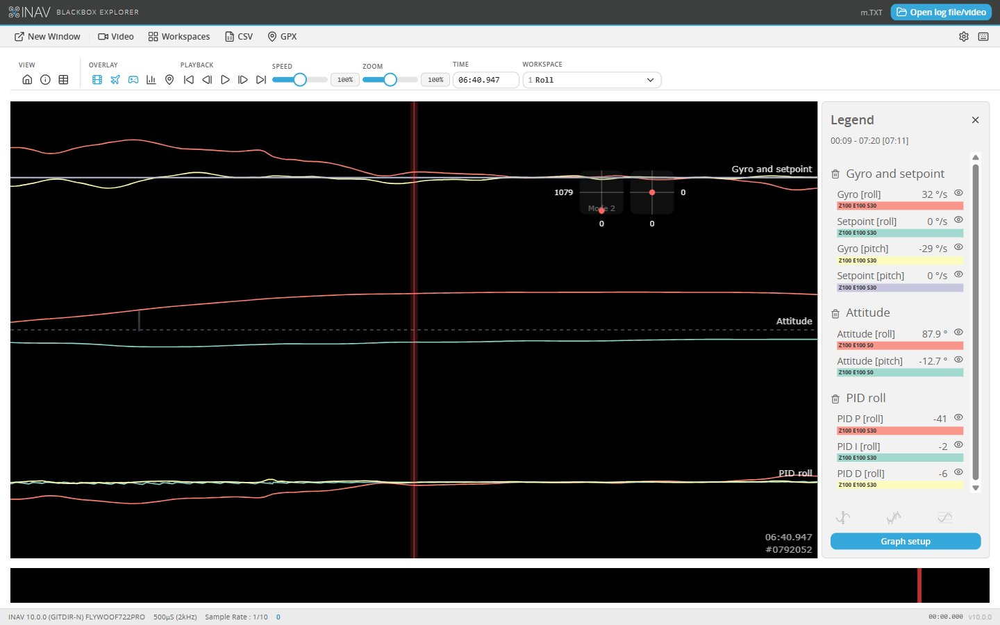
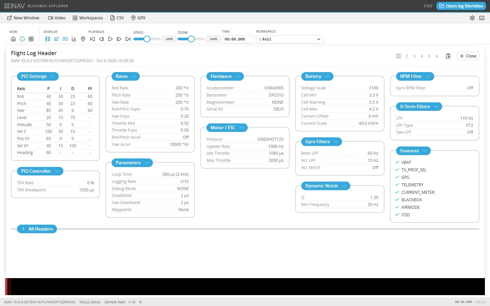

# INAV Blackbox Explorer

[](https://www.gnu.org/licenses/gpl-3.0)



This tool opens the logs recorded by INAV's blackbox, on an SD card or in the flight controller's flash. You can seek
through a log and read every logged value at each moment, as graphs, as numbers, as a picture of the craft and its
sticks, on a map, or as a frequency spectrum. If you have a flight video, it plays behind the graphs, and the graphs
can be exported as a video of their own.

It reads INAV's own fields with their names and units: modes, navigation states and failsafe phases with the
firmware's names, positions in metres, rates in degrees per second, the multirotor and fixed wing navigation
controllers, the log header in INAV's terms. Names and lookup tables follow the INAV release that wrote the log, from
INAV 7 on. Logs from older INAV releases still open.

## Installation

The explorer comes as a desktop application and as a web application; both are the same program.

### Desktop application

1. Visit the [release page](https://github.com/iNavFlight/blackbox-log-viewer/releases).
1. Download the file for your system: a zip for Windows, a dmg or zip for MacOS, a deb, rpm or zip for Linux.
1. Install or unpack it, and run **INAV Blackbox Explorer**.
1. The application is not signed, so your system may ask you to confirm that you want to run it. On MacOS, run
   `xattr -cr "/path/to/INAV Blackbox Explorer.app"` if it reports the application as damaged.

Development builds of the latest code are published as pre-releases in
[blackbox-log-viewer-nightly](https://github.com/iNavFlight/blackbox-log-viewer-nightly/releases). They are meant for
testing and may be broken.

### Web application

The same program runs in a browser, and a Chromium-based browser (Chrome, Edge) can install it as an application that
works offline afterwards: open the page, then use the install button in the address bar. The nightly releases include
it as a `_web_` zip, to be served over HTTPS or from `localhost`.

## Usage

Click **Open log file/video** at the top right and choose the log, a `.TXT` file from an SD card or the file
downloaded from the flight controller's flash by INAV Configurator, and your flight video if you recorded one. On the
desktop you can also open a log with the application from your file manager. A file that holds several flights opens
on the first, and a selector in the legend switches to the others.

Scroll through the log by clicking or dragging on the seek bar under the graphs. The current time is the vertical red
bar in the centre of the graph; click and drag left and right on the graph to scrub backwards and forwards. The
keyboard icon at the top right lists the keyboard shortcuts.

### Graphs and workspaces

**Graph setup**, under the legend, chooses which fields are plotted. **Add graph** offers ready-made graphs for INAV:
motors and servos, gyro and setpoint, the PID terms of each axis, attitude, battery, altitude and speeds with their
navigation targets, the navigation controllers, airspeed, wind, GPS and more. The first time, a plane opens on its
servos and gyros and a multirotor on its motors and gyros; after that the explorer keeps the graphs you last used.

A workspace is a set of graphs kept in one of ten slots, switched with the keys **1** to **0** (**Shift** with the key
saves the current graphs there). The **Workspaces** menu
fills them with presets for multirotors (roll, pitch and yaw tuning, gyro filtering, altitude and position hold,
battery, GPS) or for planes (roll, pitch and yaw tuning on the servos, attitude, altitude, navigation, airspeed and wind,
battery), and saves your own.

### Log header

The **i** button shows the settings the flight controller wrote at the start of the log, in INAV's terms: PIDs with the
navigation controllers, rates, filters, motor protocol, battery, sensors and features. **All Headers** lists every
header line as the log has it.



### Craft, sticks, map and spectrum

The craft view shows a multirotor's motors, or for a plane an artificial horizon from INAV's attitude, a throttle bar per
motor and the travel of each servo. The sticks view shows the RC commands, the map the GPS track, and the spectrum
analyser the frequency content of the selected field, with the gyro and D-term filter cutoffs from the log's header.

### Syncing your log to your flight video

The blackbox plays a short beep on the buzzer when arming, and this corresponds with the start of the logged data. You
can sync your log against your flight video by pressing the "start log here" button when you hear the beep in the
video. You can tune the alignment of the log manually by pressing the nudge left and nudge right buttons in the log sync
section, or by editing the value in the "log sync" box. Positive values move the log toward the end of the video,
negative values move it towards the beginning.

### Exporting

The toolbar exports the log as CSV, the GPS track as GPX, and the graphs as a WebM video, over the flight video if one
is loaded.

## Common problems

### Flight video won't load, or jumpy flight video upon export

Some flight video formats aren't supported by Chromium, so the explorer can't open them. You can fix this by
re-encoding your video using the free tool [Handbrake][]. Open your original video using Handbrake. In the output
settings, choose MP4 as the format, and H.264 as the video codec.

Because of [Chromium bug #66631][], H.264 videos that use B-frames cannot be seeked accurately. This is mostly fine when
viewing the flight video inside the explorer. However, if you use the "export video" feature, this bug will cause the
flight video in the background of the exported video to occasionally jump backwards in time for a couple of frames,
causing a very glitchy appearance.

To fix that issue, you need to tell Handbrake to render every frame as an intraframe, which will avoid any problematic
B-frames. Do that by adding "keyint=1" into the Additional Options box:


Hit start to begin re-encoding your video. Once it finishes, you should be able to load the new video into the
explorer.

[Handbrake]: https://handbrake.fr/
[Chromium bug #66631]: http://code.google.com/p/chromium/issues/detail?id=66631

### A field shows the wrong name or unit, or a log does not open

Open an issue with the log attached: most of these can only be found with the log that shows them.

## Developing

The explorer is built with [Vite](https://vitejs.dev/), Vue 3, Pinia and Nuxt UI; the desktop application is the same
build in [Electron](https://www.electronjs.org/), packaged with electron-forge as INAV Configurator is.

### Setup

Node.js 22 (see `.nvmrc`; with [nvm](https://github.com/nvm-sh/nvm), run `nvm use`), then:

```bash
npm install
npm start               # development server with hot reload, http://localhost:5173/
```

### Building

```bash
npm run build           # the web application, in dist/
npm run preview         # serve that build, http://localhost:4173/, from where it can be installed
npm run desktop         # build for the desktop and run it in Electron
npm run desktop:make    # desktop packages for this system, in out/make/
npm run lint            # what the CI checks
```

`.github/workflows/ci.yml` builds the web application and the desktop packages for Linux, MacOS and Windows on every
pull request; `nightly-build.yml` publishes them from `master` to the nightly repository.

### Where INAV lives in the code

INAV's names, units, graphs and header view are kept in their own modules:

| file | what it holds |
|---|---|
| `src/inav_defs.js` | INAV's names for modes, states, navigation, failsafe, sensors, and the per-release lookup tables. Generated: do not edit |
| `tools/inav-defs.mjs` | the generator: `node tools/inav-defs.mjs PATH_TO_INAV_REPO [GIT_REV]` reads them from the firmware's sources |
| `src/inav_header.js` | INAV header lines, the tables for a log's release, the filter values the spectrum analyser needs |
| `src/inav_header_view.js` | the log header dialog for INAV logs |
| `src/inav_presenter.js` | INAV's units and flag names in the legend and the tables |
| `src/inav_field_names.js` | friendly names of INAV's fields |
| `src/inav_graphs.js` | the example graphs and the defaults for planes and multirotors |
| `src/inav_workspaces.js` | the workspace presets |
| `src/craft_wing.js` | the craft view for planes |
| `electron/` | the desktop application's main process and preload |

When INAV adds a mode, a navigation state or a setting table, regenerate `src/inav_defs.js` from the release's tag.

### Driving the explorer from a script

A development build, or any build opened with `?debug` in the address, exposes `window.inavDebug`, which loads logs and
reads values without the interface, for checks run through a browser's remote debugging:

```js
await inavDebug.loadUrl("/path/to/LOG00001.TXT")   // in development, /__debug/file?path=... serves local files
inavDebug.seek(0.5)                                // a time in microseconds, or a fraction of the log
inavDebug.values(["navPos[2]", "attitude[0]"])     // raw and displayed values now
inavDebug.header()                                 // the parsed header
inavDebug.theme("dark")                            // "dark", "light" or "auto"
```

## License

This project is licensed under GPLv3. Open Sans and the INAV logo and icons come from INAV Configurator.
